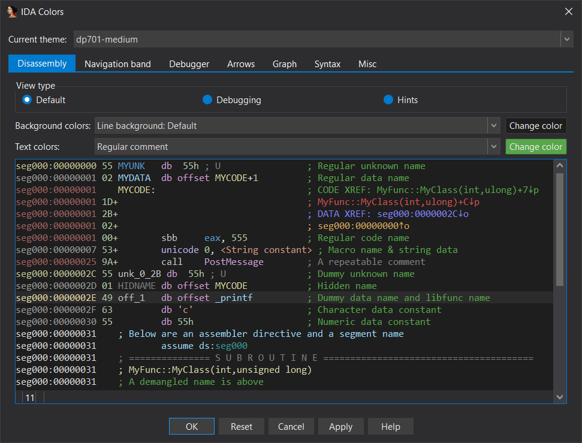
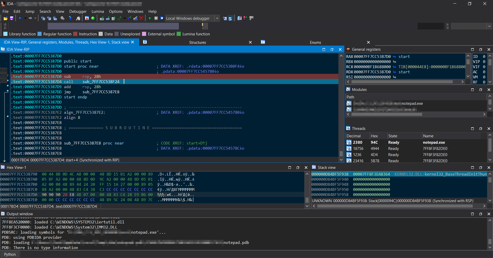
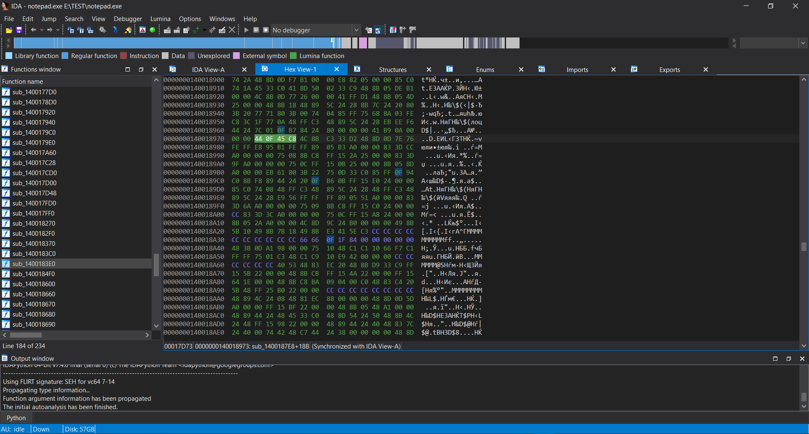
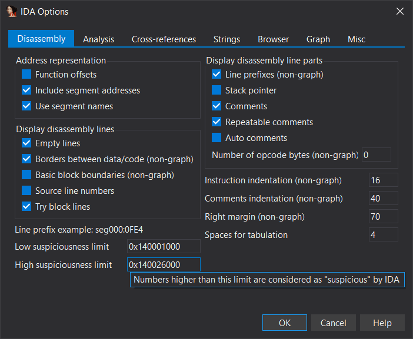

# dp701 theme for IDA Pro
Dark theme inspired by Visual Studio

# Features

- Multiple sizes for different DPI
- Attention to detail

# Preview


# Requirements

- IDA version **7.3** or newer
- Installed **Segoe UI** and **Consolas** fonts

# Installation

## Install theme

- Copy the contents of `theme/*` into the IDA directory `themes/*`
- Start IDA and select the theme by to the screen resolution in `Options > Colors...`

## Change fonts

The font is already set in the theme file, but you can change it by opening `theme.css` and going to the block `Block for personalization` at the end of the file.

### Known Issue

There is a bug in the IDA that resets the parameters from the `CSS` for fonts.

Solution is set the font (**Consolas**) for the disassembler window in `Options > Font...`.  or apply [reg](https://wiki.winehq.org/Regedit) file (for Windows):

```ini
Windows Registry Editor Version 5.00

; Delete IDA fonts configuration
[-HKEY_CURRENT_USER\SOFTWARE\Hex-Rays\IDA\Font]
```

## Color settings for other plugins

Pre-calculated color settings for plugins.

### deREferencing

For the [deREferencing](https://github.com/danigargu/deREferencing) plugin, change the specified settings in the file `deferencing/config.py`:

```python
highlight_changes = True
highlight_color   = 0x784f26
```

## Optional for Windows 10

This methods works only for **Windows 10**.

### Change color of active and inactive title bars

These options will change your desktop window settings.

- Apply the [reg](https://wiki.winehq.org/Regedit) file:

  ```ini
  Windows Registry Editor Version 5.00
  
  ; Automatically Pick a Color from your Background
  [HKEY_CURRENT_USER\Control Panel\Desktop]
  "AutoColorization"=dword:00000000
  ; Active/Inactive Window Title Bar
  [HKEY_CURRENT_USER\SOFTWARE\Microsoft\Windows\DWM]
  "AccentColor"=dword:ff302d2d
  "AccentColorInactive"=dword:ff494949
  ; Show accent color on the following surfaces
  ; Start, taskbar, and action center
  [HKEY_CURRENT_USER\Software\Microsoft\Windows\CurrentVersion\Themes\Personalize]
  "ColorPrevalence"=dword:00000001
  ; Title bars
  [HKEY_CURRENT_USER\Software\Microsoft\Windows\DWM]
  "ColorPrevalence"=dword:00000001
  ```

# More screenshots

A little more screenshots

## Colors



## Debug



## Hex



## Options



# Why is dp701?

Codename of the project is **d**ark **p**roject, **701** is the number of attempts to create it :smile:

